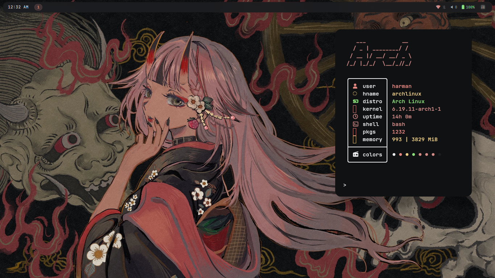

# Harman's Mango Config


| Component | Tool |
|-----------|------|
| **WM** | MangoWM |
| **Terminal** | Kitty |
| **Widgets** | QuickShell |
| **App Launcher** | Quickshell |
| **Lockscreen** | Hyprlock |
| **Notifications** | Tiramisu + Quickshell |
| **Wallpapers** | awww |
| **Bar** | Quickshell |

## Video Showcase


## Screenshots




## Installation

```bash
git clone https://github.com/Harman1307/MangoWM-Dotfiles.git
cd MangoWM-Dotfiles
chmod +x install.sh
./install.sh
```
> Note: This will backup your existing config before installing 

Inspired by: ViegPhunt, binnewbs, Mon4sm, r/unixporn


### THANKS FOR READING :)
